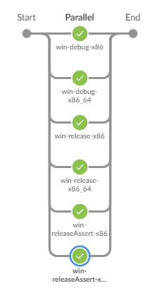

# jenkins-builder-dsl

[](http://tabeyti-jenkins.duckdns.org:8080/job/tabeyti/job/tool-jenkins/job/master/)

A (declarative friendly) DSL "step" for easily and cleanly defining bodies of work to run in parallel on targeted agents.


## Repo Structure
|Type|Directory|Description|
|-------|----------|----------|
|Class Libraries|```src/org/tools/**```|A collection of classes to be used in the builder DSL.|
|Library Steps|```vars/**```|Houses the `builder` step and its dependencies.|
|Library Step Tests|```tests/**```|Integration tests for `var` steps.|
|Repo Scripts|```scripts/**```|Scripts for generating documentation and such.|

## Example

See [examples.md](examples.md) for additional use cases.

```groovy
/**
* Spawns 6 tasks (determined by the defined "axes") to run in parallel. Each spawned task will:
* - Run on an available agent with label 'win-large'
* - Use the credentials list defined
* - Checks out github repo
* - Calls a shell step
*/
builder('win') {

    node    'win-large'

    axes    VARIANT:['debug', 'release', 'releaseAssert'],
            ARCH:   ['x86_64', 'x86']

    creds   string(credentialsId: 'my-api-token', variable: 'TOKEN'),
            string(credentialsId: 'my-secret-key', variable: 'KEY')

    git     url: "git@github.com:myorg/my-repo.git",
            branch: 'v1.1.0',
            credentialsId: 'my-ssh-key'

    sh      label:  'build.py',
            script: 'python -u tools/build.py ' + argstr(
                    '-b',
                    '--buildnum $BUILD_NUMBER',
                    "--comment \"${params.COMMENT}\"",
                    '--password "$TOKEN"',
                    '--variant $VARIANT',
                    '--arch $ARCH',
                    "--branch ${params.GIT_BRANCH_PARAM}"
            )
}
```


## Docs/API

See [dsl.md](dsl.md) for what you can do in a `builder` call, including steps, tasks, notifications, etc.


## Possible Script Approvals

These are potential approvals that may need to be approved in order for this DSL to run:
* `groovy.lang.GroovyObject getProperty java.lang.String (TaskDSL.scm)`