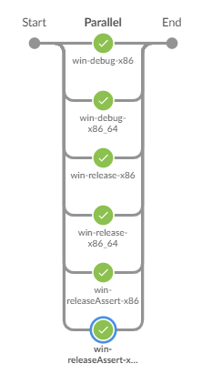

# Examples
- [Examples](#examples)
  - [General](#general)
  - [Defining Multiple Tasks](#defining-multiple-tasks)
  - [Nested Tasks](#nested-tasks)
  - [Post Tasks](#post-tasks)
  - [Declarative usage](#declarative-usage)

## General

```groovy
/**
* Spawns 6 tasks (determined by the defined "axes") to run in parallel. Each spawned task will:
* - Run on an available agent with label 'win-large'
* - Use the credentials list defined
* - Checks out defined github repo
* - Calls the defined shell step
*/
builder('win') {

    node    'win-large'
    axes    VARIANT:['debug', 'release', 'releaseAssert'],
            ARCH:   ['x86_64', 'x86']

    // A comma separated list of credentials
    creds   string(credentialsId: 'my-api-token', variable: 'TOKEN'),
            string(credentialsId: 'my-secret-key', variable: 'KEY')

    git     url: "git@github.com:myorg/my-repo.git",
            branch: 'v1.1.0',
            credentialsId: 'my-ssh-key'

    sh      label:  'build.py',
            script: 'python -u tools/build.py ' + argstr(
                    '-b',
                    '--buildnum $BUILD_NUMBER',
                    "--comment \"${params.COMMENT}\"",
                    '--password "$TOKEN"',
                    '--variant $VARIANT',
                    '--arch $ARCH',
                    "--branch ${params.GIT_BRANCH_PARAM}"
            )
}
```


## Defining Multiple Tasks

```groovy
/**
* Spawns 5 tasks to run parallel: 3 for 'win' and 2 for 'mac'.
*
* Both task blocks use shared steps defined at the top level for
* source checkout, credentials, and a shell for installing deps.
*
* Once parallel execution completes, the 'notify' block is evaluated,
* and will send a slack message on 'FAILURE'.
*/
builder {

    // NOTE: Shared steps are not used in the block/scope they are defined; only for children
    // defined (task, post) in the same scope and beyond.
    share {
        creds   string(credentialsId: 'my-api-token', variable: 'TOKEN'),
                string(credentialsId: 'my-uname-pwd', usernameVariable: 'USER', passwordVariable: 'PWD')

        git     url: "git@github.com:myorg/my-repo.git"

        sh      label:  'pip install',
                script: 'pip install --upgrade -r Tools/build/requirements.txt'
    }

    task('win') {
        node    'win-large'
        axes    VARIANT:['debug'],
                ARCH:   ['x86_64', 'x86']

        sh      label:  'build.py',
                script: 'python -u tools/build.py ' + argstr(
                        '-b',
                        '--buildnum $BUILD_NUMBER',
                        '--username $USER',
                        '--password $PWD',
                        '--token "$TOKEN"',
                        '--variant $VARIANT',
                        '--arch $ARCH'
                )
    }

    task('mac') {
        node    'mac-large'
        axes    VARIANT:['debug'],
                ARCH:   ['x86_64']

        sh      label:  'build.py',
                script: 'python -u tools/build.py ' + argstr(
                        '-b',
                        '--buildnum $BUILD_NUMBER',
                        '--username $USER',
                        '--password $PWD',
                        '--token "$TOKEN"',
                        '--variant $VARIANT',
                        '--arch $ARCH'
                )
    }

    notify {
        on          'FAILURE'
        showErrors  true
        slackSend   channel: 'my-notifications-channel',
                    color: "#00FF00",
                    message:"*FAILED:* ${env.JOB_NAME} #${env.BUILD_NUMBER}: ${env.BUILD_URL}"
    }
}
```


## Nested Tasks

```groovy
/**
* Spawns 2 tasks (x86, x86_64) that call a shell, then in turn
* each spawn their own task to execute, for a total of 4 tasks.
*/
builder {

    share {
        git     url: "git@github.com:myorg/my-repo.git"
    }

    task('win') {
        node    'win-large'
        axes    ARCH:   ['x86', 'x86_64']

        sh      label:  'build.py',
                script: 'python -u tools/build.py --arch $ARCH --buildnum $BUILD_NUMBER'

        task('test') {
            node    'win-large'
            sh      label: 'test.py',
                    script: 'python -u tools/test.py --sourcedir build/'

        }
    }
}
```


## Post Tasks

```groovy
/**
* Runs some parallel tasks, then a 'post' task following parallel execution.
* NOTE: Post tasks are always executed in serial.
*/
builder {

    share {
        git     url: "git@github.com:myorg/my-repo.git"
    }

    task('win') {
        node    'win-large'
        axes    ARCH: ['x86', 'x86_64']

        sh      label:  'build.py',
                script: 'echo python -u tools/build.py --arch $ARCH --buildnum $BUILD_NUMBER'
    }

    post('publish') {
        node    'win-small'

        build   job: 'test',
                parameters: [string(name: 'PARENT_BUILD', value: "$BUILD_NUMBER")]
    }
}
```


## Declarative usage

```groovy
pipeline {
    agent none
    options  {
        skipDefaultCheckout()
    }

    stages {
        stage ('build') {
            steps {
                builder('win') {
                    node    'win-large'
                    axes    VARIANT:['debug', 'release', 'releaseAssert'],
                            ARCH:   ['x86_64', 'x86']

                    creds   string(credentialsId: 'my-auth-token', variable: 'TOKEN')
                    git     url:    'git@github.com:myorg/myrepo.git',
                            branch: 'master'

                    sh      label:  'build.py',
                            script: 'python -u tools/build.py ' + argstr(
                                    '-b',
                                    '--buildnum $BUILD_NUMBER',
                                    '--password "$TOKEN"',
                                    '--variant $VARIANT',
                                    '--arch $ARCH'
                            )
                }
            }
        }

        stage('publish') {
            when {
                expression { 'RC' == BUILD_TYPE }
            }
            agent { label 'win-small' }

            steps {
                git     url:    'git@github.com:myorg/myrepo.git',
                        branch: 'master'

                sh      label: 'publish.py',
                        script: 'python -u tools/publish.py --buildnum $BUILD_NUMBER'
            }
        }
    }

    post {
        failure {
            slackSend   channel: 'my-notifications-channel',
                        color: "#00FF00",
                        message:"*FAILED:* ${env.JOB_NAME} #${env.BUILD_NUMBER}: ${env.BUILD_URL}"
        }
    }
}
```

